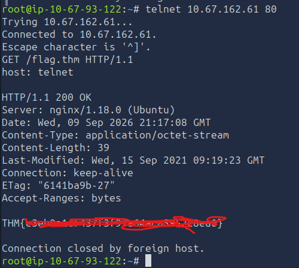

### Find The Flag!

Used `telnet` for an unencrypted communication to the `HTTP port 80`

In order to find the "flag" I needed to use the `GET` feature and retrieve the contents of `flag.thm`

Through this task I learned why we would use `HTTPS` over `HTTP` and what exactly `telnet` can be used for

I also learned the 'under the hood' aspects of `HTTP` communication and how it actually works

