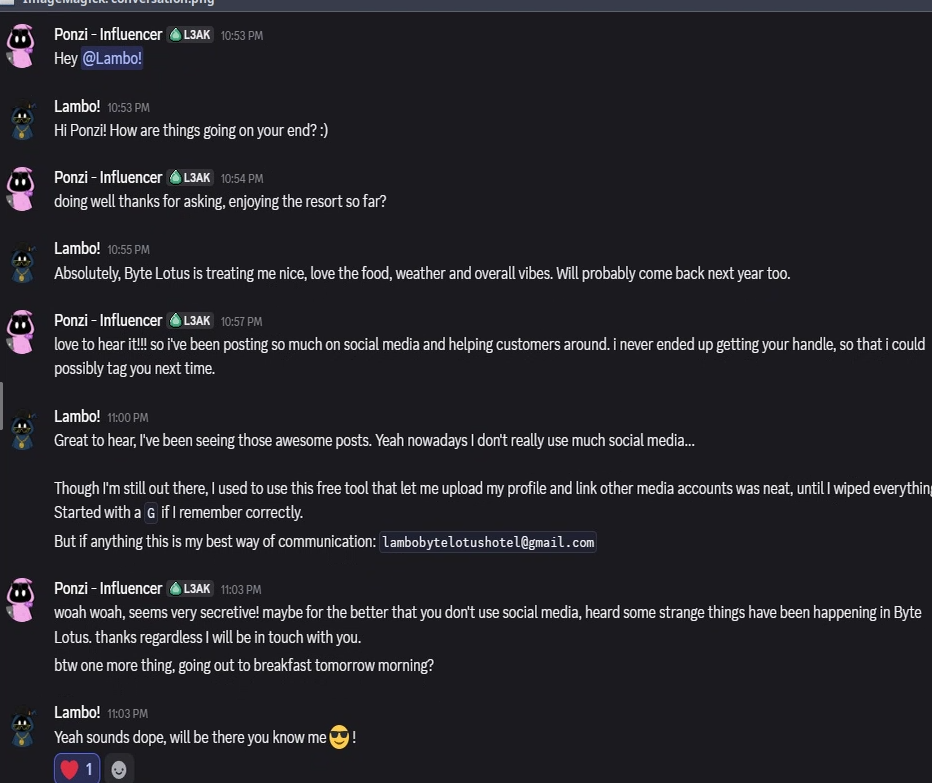
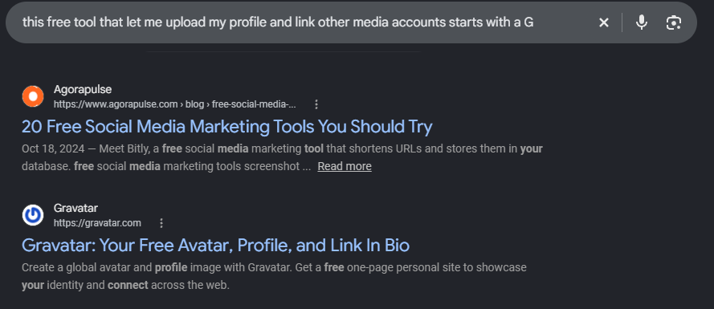

# TryHackMe — Overheard At Breakfast:

The challenge involved identifying an account using information from a leaked conversation.
The conversation contained an email address and a clue about a profile service. I then followed those clues to identify the account and find the flag.

I then googled the hint to figure out which service the clue was mentioning

Upon further investigation of Gravatar, I found out that they use a SHA256 hash of the email to locate the profile. 
This is when i used `printf '%s' 'lambobytelotushotel@gmail.com' | sha256sum`. The `printf` outputs the email without adding a newline, then `|` pipes the email into `sha256sum`, which then generates the SHA-256 hash. The resulting hash was used to query the Gravatar profile

`curl https://gravatar.com/<SHA256_HASH>.json`
